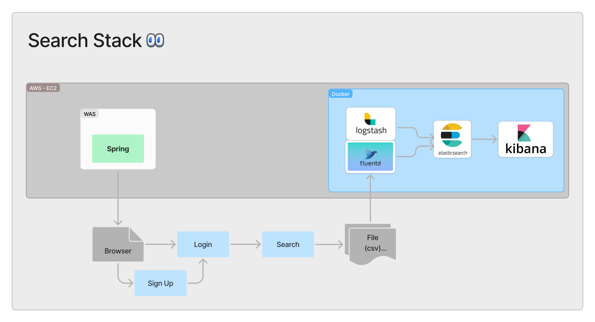
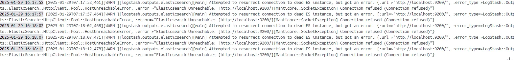

#  Search Stack
### 이 프로젝트는 데이터 수집, 처리, 시각화를 통해 로그 데이터를 효과적으로 활용하는 방법을 배우는 데 중점을 둡니다.

## 목차
1. [Team](#1-team)
2. [Project Intro & Subject](#2-project-intro--subject)
3. [Stack and Tools](#3-stack-and-tools)
4. [Architecture](#4-architecture)
5. [How to Run](#5-how-to-run)
6. [Troubleshooting](#6-troubleshooting)
   - [6-1. Fluent에서 Elasticsearch Output Plugin을 찾을 수 없는 오류](#6-1-fluent에서-elasticsearch-output-plugin을-찾을-수-없는-오류)
   - [6-2. Elasticsearch 7.11.1과 Elasticsearch Client 8.17.1의 버전 차이 문제](#6-2-elasticsearch-7111과-elasticsearch-client-8171의-버전-차이-문제)
   - [6-3. Fluentd Test.log 파일을 읽지 못하는 문제](#6-3-fluentd-testlog-파일을-읽지-못하는-문제)
   - [6-4. Logstash 포트 설정 에러](#6-4-logstash-포트-설정-에러)
   - [6-5. Logstash와 Elasticsearch 연결 실패 오류](#6-5-logstash와-elasticsearch-연결-실패-오류)


## 1. Team

👥 팀명 : 설날에 집에 있는 사람들

||||||
|:-:|:-:|:-:|:-:|:-:|
|나원호<br/>[@CooolRyan](https://github.com/CooolRyan)|한정현<br/>[@letsgojh0810](https://github.com/letsgojh0810)|이슬기<br/>[@seulg2027](https://github.com/seulg2027)|구민지<br/>[@minjee83](https://github.com/minjee83)|김대연<br/>[@dyoun12](https://github.com/dyoun12)|


## 2. Project intro & subject

💙 프로젝트명 : 검색 로그 모니터링 시스템 구축 프로젝트

🩵 프로젝트 개요 : 본 프로젝트에서는 **웹 서비스의 검색 로그 및 사용자 로그 데이터를 자동으로 수집하고 저장하는 파이프라인을 구축**한다. Spring Boot의 Logback을 활용해 데이터를 전송하고, ELK, EFK에서 로그 데이터를 수집, 처리, 시각화한다. 이를 통해 로그 데이터를 자동으로 관리하여 시스템을 안정적으로 운영하는 방법을 실습한다.

🤍 프로젝트 목표 : ELK와 EFK의 차이 이해하기, Spring Logback/Filter/Security 실습하기


## 3. Stack and Tools

| 기술           | 설명                         |
|----------------|------------------------------|
|    | 데이터 수집 및 처리 도구 |
|       | 데이터 수집 및 처리 도구      |
|     | 데이터 검색 및 분석 엔진      |
|         | 데이터 시각화 및 대시보드 도구 |
|         | user 정보를 저장하는 관계형데이터베이스  |
|         | ELK, EFK, mysql을 컨테이너화해 실행시키는 가상화 플랫폼  |
|         | ELK 및 EFK로 로그 데이터를 전송하는 WAS 서버 구축 도구  |

## 4. Architecture



## 5. How to run


## 6. Troubleshooting

### 6-1. Fluent에서 elasticsearch output plugin을 찾을 수 없는 오류
docker-compose 실행 중에 fluentd 컨테이너에서 다음과 같은 에러가 발생

```
2025-01-28 16:42:06 2025-01-28 07:42:06 +0000 [error]: config error file="/fluentd/etc/fluent.conf" error_class=Fluent::NotFoundPluginError error="Unknown output plugin 'elasticsearch'. Run 'gem search -rd fluent-plugin' to find plugins"
```

fluentd 컨테이너에 마운트된 fluent.conf 파일 내용

``` yml
<match **>

@type elasticsearch

host elasticsearch

port 9200

index_name fluentd-log

logstash_format true

</match>
```

@type elasticsearch으로 선언했으나 플러그인을 설치되지 않아 오류가 발생한 것으로 보인다.


[How to installation fluent-plugin-slasticsearch](https://github.com/uken/fluent-plugin-elasticsearch?tab=readme-ov-file#installation)


문제 해결을 위해 fluentd 이미지는 dockerfile을 이용해 해당 플러그인을 설치한 뒤 빌드하도록 설정한다.

```dockerfile
FROM fluent/fluentd:v1.18-1

USER root

ENV FLUENTD_DISABLE_BUNDLER_INJECTION 1

RUN gem install fluent-plugin-elasticsearch
  
USER fluent

CMD ["fluentd", "-c", "/fluentd/etc/fluent.conf", "-p", "/fluentd/plugins"]
```

--- 

### 6-2. elasticsearch 7.11.1 과 elasticsearch client 8.17.1의 버전 차이 문제

elasticsearch 플러그인을 인식하지만 fluentd의 elasticsearch client의 버전 8.17.1과 elasticsearch image 버전 7.11.1 버전이 맞지 않아 fluentd 컨테이너가 종료되는 문제가 발생

```
2025-01-29 13:47:18 2025-01-29 04:47:18 +0000 [error]: #0 config error file="/fluentd/etc/fluent.conf" error_class=Fluent::ConfigError error="Using Elasticsearch client 8.17.1 is not compatible for your Elasticsearch server. Please check your using elasticsearch gem version and Elasticsearch server."

2025-01-29 13:47:18 2025-01-29 04:47:18 +0000 [error]: Worker 0 exited unexpectedly with status 2
```

dockerfile 빌드 시 Elasticsearch 7.11.1 버전에 맞는 elasticsearch gem 설치

```dockerfile
FROM fluent/fluentd:v1.18-1

USER root

ENV FLUENTD_DISABLE_BUNDLER_INJECTION 1

# Elasticsearch 7.x에 맞는 클라이언트 버전(7.17.10) 설치
RUN gem install elasticsearch -v 7.17.10 && \
gem install fluent-plugin-elasticsearch --no-document

USER fluent

CMD ["fluentd", "-c", "/fluentd/etc/fluent.conf", "-p", "/fluentd/plugins"]
```

### 6-3. fluentd test.log 파일을 읽지 못하는 문제
컨테이너 내부 쉘 접속 후 파일 정보 확인

``` bash
/var/log $ ls -al 

total 8 
drwxr-xr-x 4 root root 128 Jan 29 05:25 . 
drwxr-xr-x 12 root root 4096 Sep 6 11:35 .. 
drwxr-xr-x 3 fluent fluent 96 Jan 29 05:01 fluentd 
-rw-r--r-- 1 1000 1000 308 Jan 29 05:25 test.log
```

test.log 파일의 사용자가 1000 1000 이를 fluent 유저로 변경하기 위해 dockerfile에서 entrypoint 지정

```bash
# entry.sh

# 로그 파일이 없으면 생성
touch /var/log/test.log

# fluent 유저가 파일을 사용할 수 있도록 변경
chown fluent:fluent /var/log/test.log
chmod 644 /var/log/test.log

# Fluentd 실행
exec fluentd -c /fluentd/etc/fluent.conf -p /fluentd/plugins
```

이미지 빌드 후 확인

```bash
/var/log $ ls -al 

total 8 
drwxr-xr-x 4 root root 128 Jan 29 05:25 . 
drwxr-xr-x 12 root root 4096 Sep 6 11:35 .. 
drwxr-xr-x 3 fluent fluent 96 Jan 29 05:01 fluentd 
-rw-r--r-- 1 fluent fluent 308 Jan 29 05:25 test.log
```

### 6-4. Logstash 포트 설정 에러

```bash
in net.logstash.logback.appender.LogstashTcpSocketAppender[LOGSTASH] - Log destination localhost/<unresolved>:5044: Waiting 29959ms before attempting reconnection.
```

✅ 원인을 찾아보니, localhost:5044 서버에서 응답이 없었다.

```
 ✘ iseulgi@iseulgiui-MacBookPro  ~  curl "http://localhost:5044"
curl: (52) Empty reply from server
```

1. Docker Compose 설정 파일에서 tcp 포트를 추가

```yml
ports:
- "5044:5044"
- "5000:5000/tcp"  # TCP 포트 추가
```

2. logstash.conf 설정 파일에서 tcp 포트 추가

```conf
tcp {
    port => 5000
    codec => json_lines
}
```

✔️ 설정 파일에서 위와 같이 포트를 추가해서 해당 포트를 열어주어 해결


### 6-5. Logstash와 Elasticsearch 연결 실패 오류



```bash
"Elasticsearch Unreachable: [http://localhost:9200/][Manticore::SocketException] Connection refused (Connection refused)"
```

1. java  버전 변경
    
    Window로컬에서 8버전 사용 중이었어서, 17버전으로 환경설정을 업데이트해주었다.

    그러나, Java 버전은 Docker 내부에 있는 JDK 를 사용하므로 로컬환경에 영향을 받지 않았다.
    
2. conf 파일 hosts 주소 변경
    
    `localhost:9200` 에서 `127.0.0.1:9200`, `elasticsearch:9200` 으로 변경해서 해결했다.


## 7. Compare ElasticSearch-Logstash & ElasticSearch-Fluentd 

Spring Boot 애플리케이션에서 **Logback**을 활용해 **Logstash와 Fluentd로 로그를 전송**하고, 이후 **Elasticsearch에 저장하는 두 가지 방법(E-L, E-F)**을 비교합니다.

| 비교 항목 | **E-L (Elasticsearch - Logstash)** | **E-F (Elasticsearch - Fluentd)** |
| --- | --- | --- |
| **리소스 사용량** | 높음 (JVM 기반) | 낮음 (Go 기반) |
| **성능 (속도)** | 비교적 느림 (무거운 필터링) | 빠름 (경량 설계) |
| **필터링/변환 기능** | 강력함 (Grok, GeoIP, Mutate, JSON 필터) | 상대적으로 약함 (기본적인 변환 지원) |
| **설정 난이도** | 비교적 어려움 (Logstash DSL 사용) | 쉬움 (YAML 기반 설정) |
| **Elasticsearch 최적화** | ✅ 강력한 통합 기능 제공 | 🚫 기본적인 통합만 가능 |
| **컨테이너/Kubernetes 환경** | 적합하지 않음 (무거움) | ✅ 컨테이너 환경에 최적화됨 |
| **다양한 입력 지원** | ✅ 다양한 소스 지원 (Beats, Kafka, TCP 등) | ✅ 다양한 플러그인 활용 가능 |

### ✅ 어떤 경우에 선택할까?

#### **E-L (Elasticsearch - Logstash) 추천 경우**
- ✅ **데이터 변환이 복잡한 경우** → Grok, Mutate, GeoIP 기능이 필요할 때  
- ✅ **고급 Elasticsearch 기능을 활용할 경우**  
- ✅ **Kafka, Beats 등 다양한 입력 소스를 다뤄야 하는 경우**  
- ❌ **컨테이너 환경에서는 비효율적** (리소스 사용량 많음)  

#### **E-F (Elasticsearch - Fluentd) 추천 경우**
- ✅ **컨테이너/Kubernetes 기반 로그 수집** (경량 & 빠름)  
- ✅ **간단한 로그 필터링과 데이터 변환**  
- ✅ **빠르고 가벼운 로깅 시스템을 원할 때**  
- ❌ **복잡한 데이터 변환이 필요할 경우 비효율적**  

---

### **📌 결론**
- **Logstash (E-L)** → 강력한 데이터 변환 & 다양한 입력 소스 지원 (**무거움**)  
- **Fluentd (E-F)** → 가볍고 빠르며 컨테이너 환경에 적합 (**간결한 설정**)  

**어떤 아키텍처를 선택할지는 사용자의 요구사항과 환경에 따라 달라집니다.** 
